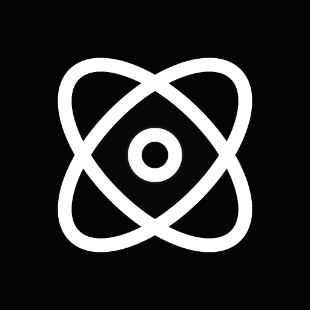
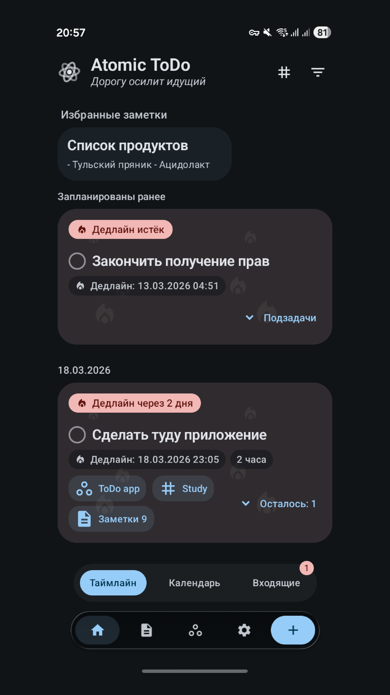
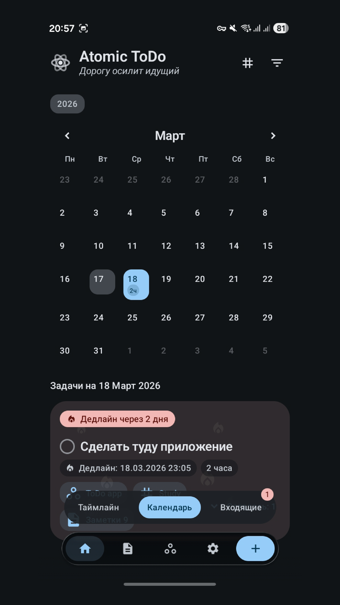
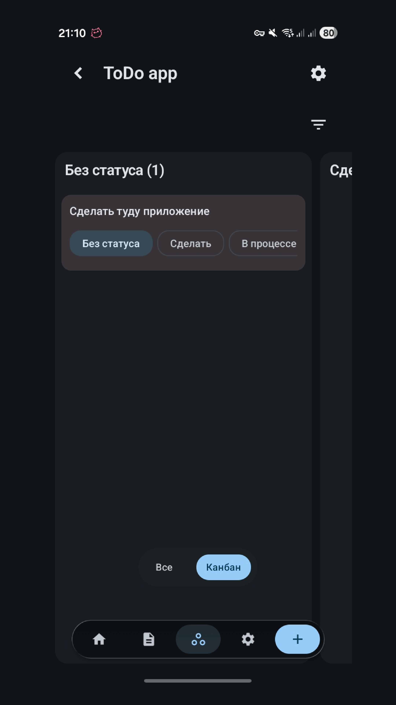
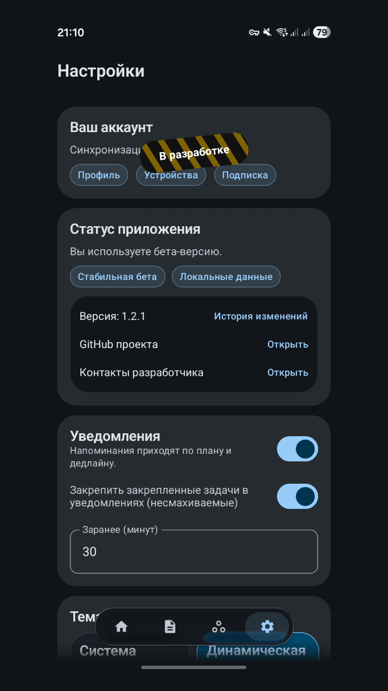
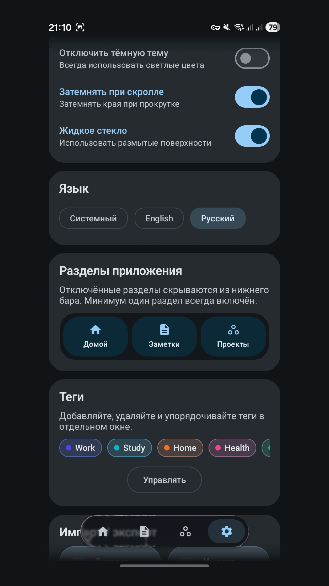
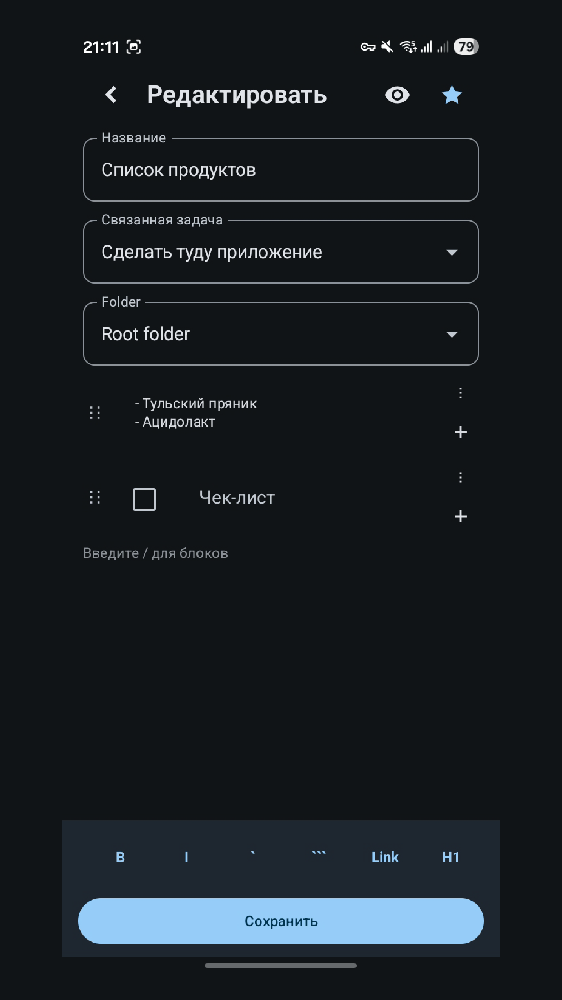
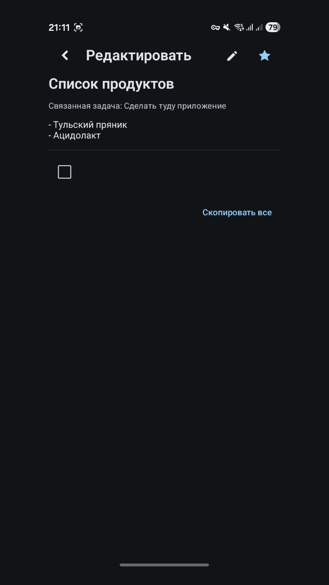
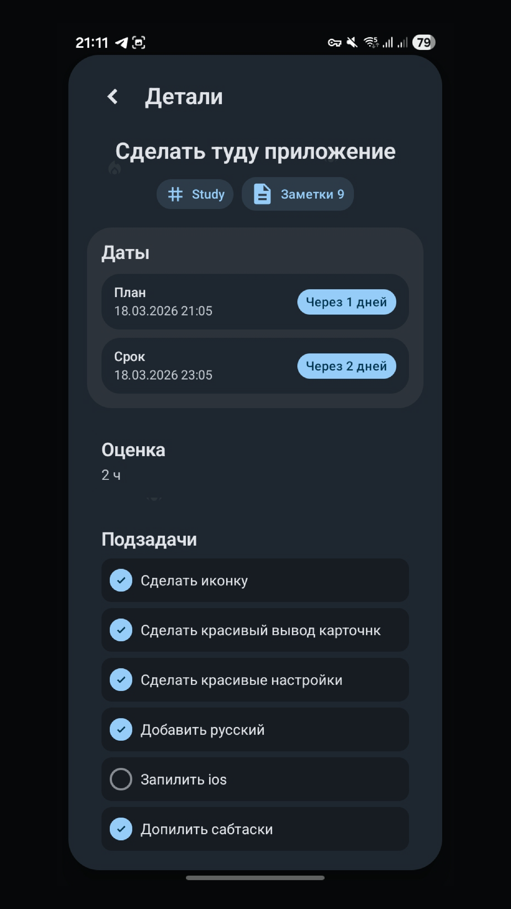

<p align="center">
  
</p>

# Atomic ToDo

Atomic ToDo — офлайн планировщик задач и заметок на Kotlin Multiplatform (Android + iOS) с упором на скорость, гибкость и локальное хранение данных.

## Установка

- RuStore: https://www.rustore.ru/catalog/app/com.grigorevmp.simpletodo
- Google Play: https://play.google.com/store/apps/details?id=com.grigorevmp.simpletodo

## Платформы

- Android (`minSdk 24`, package: `com.grigorevmp.simpletodo`)
- iOS (через Compose Multiplatform + `iosApp`)

## Технологии

- Kotlin Multiplatform
- Compose Multiplatform + Material 3
- Kotlin Coroutines, Kotlinx Serialization, Kotlinx DateTime
- Multiplatform Settings (локальное хранение)
- Navigation Compose
- Android WorkManager и Glance (виджеты)

## Возможности и интерфейс

- Задачи с приоритетами, дедлайнами, планированием, подзадачами и закреплением.
- Теги и фильтры по тегам для быстрого поиска.
- Проекты со статусами и Kanban-доской.
- Заметки с папками, избранным и связями между задачами и заметками.
- Импорт и экспорт данных в JSON для локальных бэкапов.
- Напоминания, обновление уведомлений и Android-виджет задач.
- Настройки темы, языка и видимости вкладок.

<p align="center">
  
  
  
  
</p>

<p align="center">
  
  
  
  
</p>

## Локальный запуск

### Требования

- JDK 17+
- Android Studio (для Android)
- Xcode (для iOS)

### Android

```bash
./gradlew :composeApp:assembleDebug
```

### iOS

Откройте `iosApp` в Xcode и запустите приложение на симуляторе/устройстве.

Проверка компиляции iOS из терминала:

```bash
./gradlew :composeApp:compileKotlinIosArm64
```

## Структура проекта

- `composeApp/src/commonMain/kotlin` — общая бизнес-логика и UI.
- `composeApp/src/androidMain/kotlin` — Android-специфичный код (уведомления, виджеты и т.д.).
- `composeApp/src/iosMain/kotlin` — iOS-специфичный код.
- `iosApp` — iOS host-приложение для запуска из Xcode.

## Данные и приватность

- Приложение работает локально и не требует аккаунта.
- Данные хранятся на устройстве.
- Для переноса данных можно использовать экспорт/импорт бэкапа.

## Контакты

- Telegram: https://t.me/grigorevmp
- GitHub: https://github.com/grigorevmp/SimpleToDo
